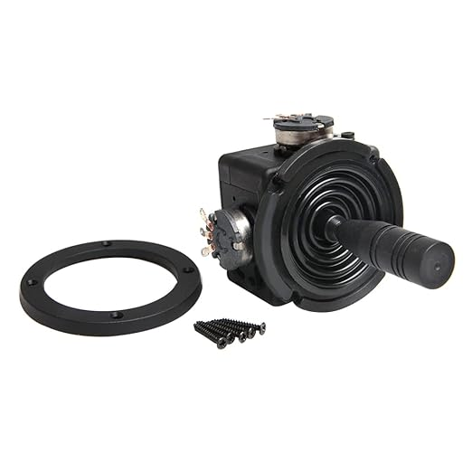
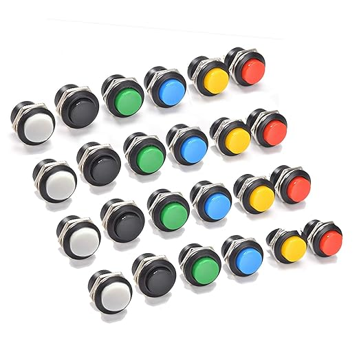
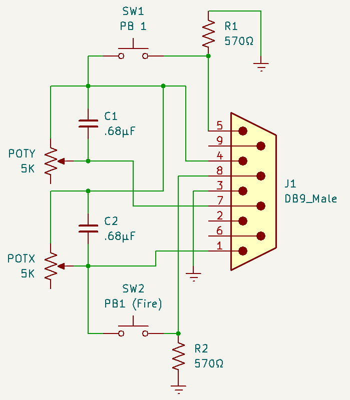
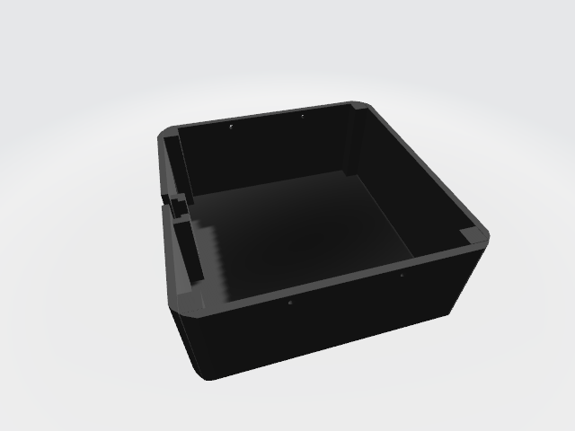
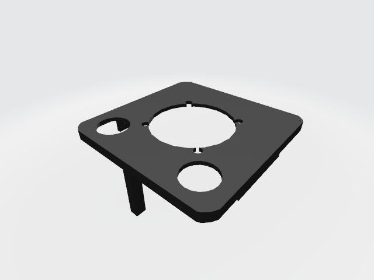
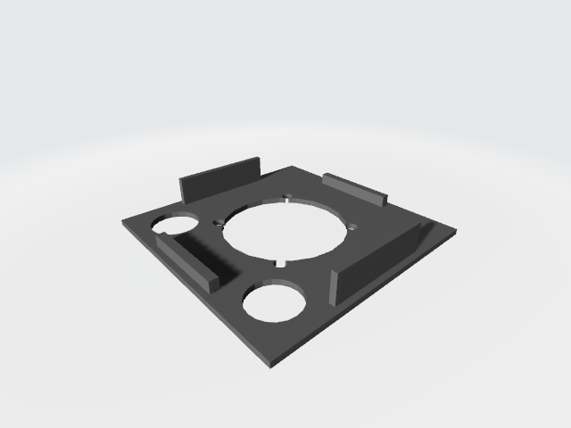
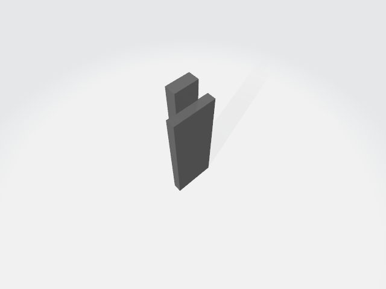

# Apple Joystick

## Overview

This is a project to build a joystick for the Apple IIe, Apple IIGS, and Apple III. It
plugs into the 9 pin female port, on the computer.

To buy a joystick for the Apple II, it is expensive. With this project, you can build
one for a fraction of the cost of the original.

## Parts

The following parts are used with the joystick. The joystick and switches can be bought
on Amazon, and will fit in the 3D printed case, included in this project. I will include
links below.

* 1 Joystick 5k
* 2 Momentary Pushbuttons
* 2 .68µF Capacitors
* 2 570K resistors
* 1 6 conductor cable
* 1 Male DB9 connector

### Joystick

The joystick that I used is the following. This joystick fits in the 3D printed case, and has
adjustments to center the joystick.

The following is a link to the joystick on Amazon.

https://www.amazon.com/dp/B09JZ8ZV4L?ref=ppx_yo2ov_dt_b_fed_asin_title

### Buttons

The buttons that I used, were 16mm momentary pushbutton switches. These switches fit in the
holes for the 3D Printed case. If you use a different diameter, you need to modify the
top of the case.

The following is a like to the switches that I used:

https://www.amazon.com/dp/B08SKJ6V7Z?ref=ppx_yo2ov_dt_b_fed_asin_title

## Schematic Diagram

The schematic is based on using 5kΩ potentiometers for the joysticks. The Apple II joystick
used 150k potentiometers. Most joysticks, sold today are either 5k or 10k. You would be hard
pressed to find a joysticks that are 150k.

The Apple II uses a 555 with an R/C circuit, to determine the position of the potentiometer.
You need to add capacitors in parallel to the joystick potentiometers, to adjust for the 
difference in resistance.

You can use the following formula to determine what capacitors value to use in parallel with
the joystick potentiometers:

    5kΩ * (x + 0.022μF) = 150kΩ * 0.022μF
    x + 0.022μF  = (150kΩ * 0.022μF) / 5kΩ
    x  = (150kΩ * 0.022μF) / 5kΩ – 0.022μF
    x = 0.638μF

The basic formula is:

    C = (3300 / R) - 0.022

Where R is in Ohms and C is in μF.

    5kΩ  = 5000Ω  = 0.638μF
    10kΩ = 10000Ω = 0.308μF

Choose a value that is close the the result. You will not be able to get an exact match.

If you are using 150kΩ potentiometers, you do not need to put a capacitor in parallel.

## 3D Printer Models

The 3D Printer STL files are included. There are two variations:

* Two piece, with the top extention.
* Three piece, with insert.

The base of the joystick is the same for both variations.

The parts are as follows:

* joystick-bottom.stl - Bottom of joystick.

   

* joystick-top.stl - Top of joystick. This includes a piece that extends to cover
the place where the wire is inserted.  This tends to break off when using
PLA.

   

* joystick-top-2 - Top of joystick. This does not include the extension piece.
You need to use the insert, to fill in the gap for the wire.

   

* joystick-insert - An insert to cover the gap for the wire, if you are using
joystick-top-2.

   
